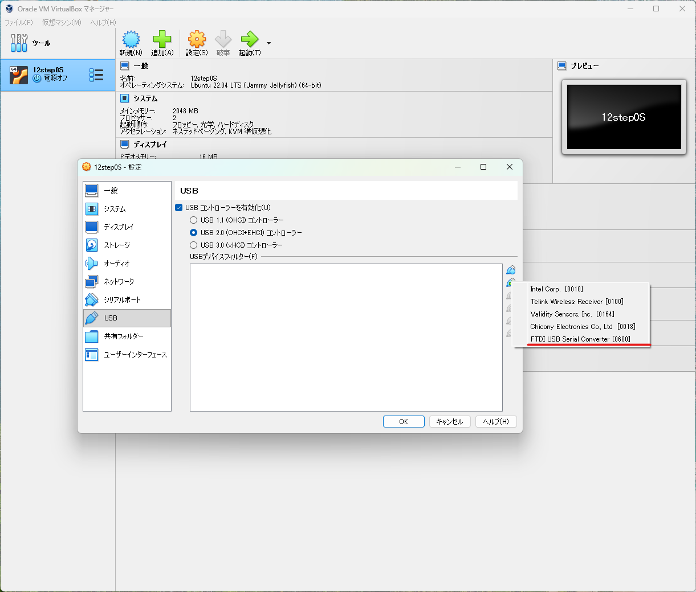

# 環境構築

## VirtualBoxインストール

* 参考：https://qiita.com/mmake/items/f62da4ed17ed6b0e5195

#### VirtualBoxで画面解像度を変更する方法

* 参考：https://nakaterux.hatenablog.com/entry/2025/01/13/042126

#### ゲストOSとホストOS間でコピペをする方法

* 参考：https://zenn.dev/nakashi94/articles/f42e0ace9766df

## Ubuntuインストール

* 参考：https://segmentation-fault.xyz/2021/04/21/676/
  
#### Windows側とSSH接続する方法

* 参考：https://hayariapp.hatenablog.com/entry/2022/02/13/173916#SSH%E6%8E%A5%E7%B6%9A

#### GitHubとSSH接続する方法

* 参考：https://note.com/yukikkoaimanabi/n/n1f1bab5c51c9

## H8開発環境構築

必要なパッケージをインストール 
```
sudo apt install build-essential cu m4
```

#### binutilsのビルド

 binutilsはテキスト記載のVer.である2.19.1とする。

```
wget https://ftp.gnu.org/gnu/binutils/binutils-2.19.1.tar.bz2
tar -jxvf binutils-2.19.1.tar.bz2
cd binutils-2.19.1/
mkdir build
cd build
../configure --target=h8300-elf --disable-nls --disable-werror
```
このあとmakeを実行すると、以下のエラーが発生してビルドに失敗する。  
`do_wide'が複数箇所に定義されており、競合している模様。  
  
```
＜エラー＞
/usr/bin/ld: dwarf.o:/home/***/binutils-2.19.1/build/binutils/../../binutils/dwarf.c:56: multiple definition of `do_wide'; readelf.o:/home/***/binutils-2.19.1/build/binutils/../../binutils/readelf.c:168: first defined here
collect2: error: ld returned 1 exit status
make[4]: *** [Makefile:654: readelf] エラー 1
make[4]: ディレクトリ '/home/***/binutils-2.19.1/build/binutils' から出ます
make[3]: *** [Makefile:715: all-recursive] エラー 1
make[3]: ディレクトリ '/home/***/binutils-2.19.1/build/binutils' から出ます
make[2]: *** [Makefile:528: all] エラー 2
make[2]: ディレクトリ '/home/***/binutils-2.19.1/build/binutils' から出ます
make[1]: *** [Makefile:3986: all-binutils] エラー 2
make[1]: ディレクトリ '/home/***/binutils-2.19.1/build' から出ます
make: *** [Makefile:717: all] エラー 2
```
以下のサイトに`do_wide'の競合を解消するためのパッチ(multidef-binutils-2.19.1-tms9900-1.7.patch)が紹介されていたので拝借する。  
* 参考：https://forums.atariage.com/topic/164295-gcc-for-the-ti/page/23/#findComment-4719143
  
<br>

パッチを適応してmakeする。
```
cd ../      /* buildのディレクトリにいる場合は、binutils-2.19.1のディレクトリに移動する */
patch -p1 < multidef-binutils-2.19.1-tms9900-1.7.patch
cd build 
make
sudo make install
```


#### gccのビルド

gccをビルドする前に必要なパッケージをインストールしておく。
  
```
wget https://ftp.gnu.org/gnu/gmp/gmp-6.2.1.tar.xz

tar xvf gmp-6.2.1.tar.xz
cd gmp-6.2.1
./configure
make
make check
sudo make install

sudo ldconfig
cd ..
```
```
wget https://ftp.gnu.org/gnu/mpfr/mpfr-4.1.0.tar.xz

tar xf mpfr-4.1.0.tar.xz
cd mpfr-4.1.0
./configure
make
make check
sudo make install

sudo ldconfig
cd ..
```
```
wget https://ftp.gnu.org/gnu/mpc/mpc-1.2.1.tar.gz

tar xf mpc-1.2.1.tar.gz
cd mpc-1.2.1
./configure
make
make check
sudo make install

sudo ldconfig
cd ..
```
gccをビルドする。  
gccはテキスト記載のVer.である3.4.6とする。
```
wget http://core.ring.gr.jp/pub/GNU/gcc/gcc-3.4.6/gcc-3.4.6.tar.gz
tar zxvf gcc-3.4.6.tar.gz
cd gcc-3.4.6/
vi gcc/collect2.c
（書籍にある通りにcollect2.cを修正）

wget http://kozos.jp/books/makeos/patch-gcc-3.4.6-x64-h8300.txt
patch -p1 < patch-gcc-3.4.6-x64-h8300.txt
mkdir build
cd build/
../configure --target=h8300-elf --disable-nls --disable-threads --disable-shared --enable-languages=c --disable-werror
make
sudo make install
```

* 参考：https://segmentation-fault.xyz/2021/04/21/676/
* 参考：https://hayariapp.hatenablog.com/entry/2022/02/13/173916#binutils--gcc--kz_h8write-%E3%81%AE%E3%83%93%E3%83%AB%E3%83%89

#### kz_h8writeのビルド
次の配布サイトから kz_h8write-v0.2.1.zip をダウンロードして作業フォルダに移動する。
* 配布サイト：https://cubeatsystems.com/kz_h8write/

zipを解凍してmake実行。（make installは不要）
```
unzip kz_h8write-v0.2.1.zip
cd PackageFiles/src
make
```
makeすると、kz_h8write というファイルができる。  
テキストの通りsrc/tools/h8writeフォルダを作成して、kz_h8writeとkz_h8write.cを移動する。  
このときファイルのkz_を削除して、それぞれh8writeとh8write.cにリネイムしておく。


* 参考：https://hayariapp.hatenablog.com/entry/2022/02/13/173916#kz_h8write
  
#### VirtualBoxからシリアルデバイスを使用する方法

今回は、PCとマイコンボードを接続する際に使用するシリアルデバイスとしてFTDI社のFT232を使用する。
* https://akizukidenshi.com/catalog/g/g108343/

FTDI社製USBシリアルドライバを手動でインストールしておく。
* 参考：https://www.monoxit.com/tecmat/windowsftdiusb/

VM側の設定は、以下の通りにする。


<br>

# Hello Worldのソースコード作成

以下の配布サイトのコードを参考にHello Worldのソースコードを作成する。
  * 配布サイト：https://kozos.jp/kozos/osbook/osbook_03/01/bootload/

※フォルダ構成はテキスト記載の構造に合わせること。

#### Makefileの修正
PCとマイコンを接続してから、次のコマンドでシリアルデバイスファイルを確認する。
```
ls -l /dev/serial/by-id
```
　⇒「../../ttyUSB0」 と表示されたら、「/dev/ttyUSB0」がデバイスファイル。
Makefile内のシリアル接続先が書かれている部分を以下のとおり修正する。（デバイスファイルが「/dev/ttyUSB0」の場合）
```
H8WRITE_SERDEV = /dev/ttyUSB0
```
ソースコードのあるフォルダ（src/01/bootload）に入りmakeする。
```
cd src/01/bootload
make
```
ELF形式でビルドされた「kzload」をモトローラSトレード・フォーマット形式に変換する。
```
make image
```
マイコンボードのディップスイッチを左からON、ON、OFF、ONに変更して起動させる。（PCとボードをserialで接続する）  
　⇒フラッシュROM書き込みモードとしてマイコンボードを起動する。
マイコンボードに作成したイメージを書き込む。
```
sudo make write
```
⇒「Complete.」が表示されたらOK。
<br>
フラッシュROMから起動するために一度マイコンの電源を切ってからスイッチをON、OFF、ON、OFFにセットして電源を入れなおす。

以下のコマンドでシリアル接続する。
```
sudo chmod 666 /dev/ttyUSB0
cu -s 9600 -l /dev/ttyUSB0
```
　⇒ "Connected"と表示されればOK。  
<br>
接続できたらリセットボタンを押す。  
　⇒ "Hello World!"が出力される。  
※cuから抜けるためには、~（チルダ）と.（ピリオド）を入力する。

* 参考：https://hayariapp.hatenablog.com/entry/2022/02/13/173916#%E3%82%BD%E3%83%BC%E3%82%B9%E3%83%95%E3%82%A1%E3%82%A4%E3%83%AB%E3%81%AE%E4%BD%9C%E6%88%90


